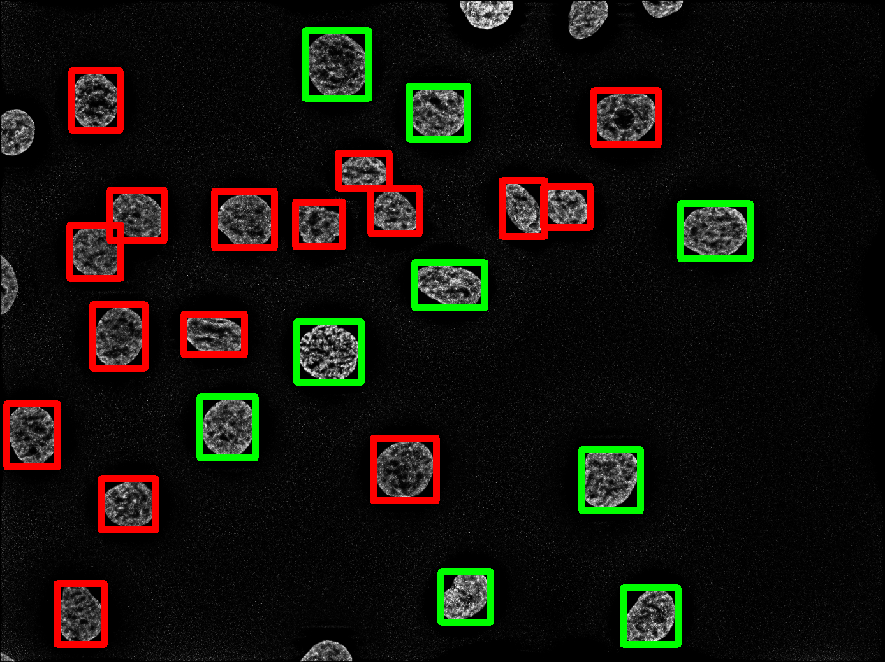

# InterphaseCellCycleStaging


Code developed to perform interphase cell cycle staging of nuclei stained with DAPI. 
If you are using this code in your research please [cite the paper](#how-to-cite).

## Overview


## How to use

To run this code please change the following directories in the file `classifier.py`:

* `img_dir:` directory containing the DAPI images


* `msk_dir:` directory containing the segmentation masks corresponding to the DAPI images in directory `img_dir` (To obtain the segmentation masks for the DAPI images use the code available in https://github.com/HemaxiN/YOLO_UNET.)


* `save_dir:` directory where the results will be saved

To perform cell cycle staging run the file `classifier.py` after changing the `img_dir`, `msk_dir` and `save_dir`. After performing classification nuclei classified as S/G2 will have a green bounding box and nuclei classified as G1 will have a red bounding box in the images present in `save_dir`, as shown in the following figure:


<p align="center">
  
</p>

Additionally, a `results.csv` file containing detailed information regarding nuclei classification will be saved in `save_dir`. It has the following structure:

| Image | pred_G1 | pred_S_G2 |
| ----- | ------- | --------- |
| MAX_304_S13_W1_SW480_CDT1_60Zs_decon_ALT.tif | 57 | 27 |
| MAX_306_S13_W1_SW480_CDT1_60Zs_decon_ALT.tif | 49 | 28 |
| ..... | ....... | ......... |

Each row contains the information for each image in `img_dir`. The first, second and third columns represent the image name, number of nuclei classified as G1 and number of nuclei classified as S/G2, respectively.

## Requirements

This implementation requires the packages listed in `requirements.txt`.


## How to cite

```bibtex
@article{narotamo2021machine,
  title={A Machine Learning Approach for Single Cell Interphase Cell Cycle Staging},
  author={Narotamo, Hemaxi and Fernandes, Maria Sofia and Moreira, Ana Margarida and Melo, Soraia and Seruca, Raquel and Silveira, Margarida and Sanches, João Miguel},
  journal={Scientific reports},
  volume={},
  number={},
  pages={13},
  year={2021},
  publisher={Nature Publishing Group}
}
```
